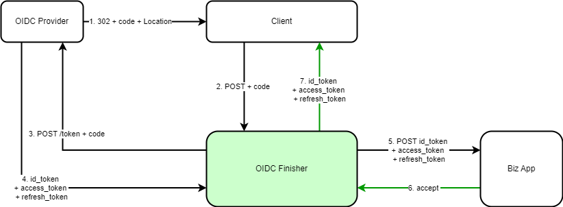
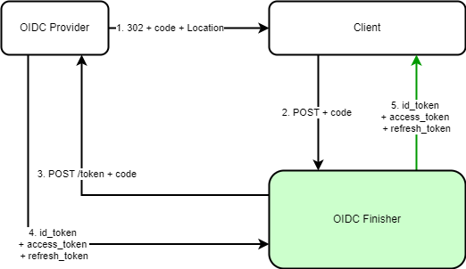
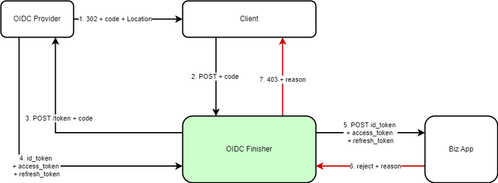

# MyLab.OidcFinisher

`MyLab.OidcFinisher` - cервис, реализующий завершение OIDC по потоку "Authorization Code Flow".

Ознакомьтесь с последними изменениями в [журнале изменений](./CHANGELOG.md).

Docker образ:   

Спецификация API  [-green)](./doc/oidc-finisher-api-v1.yml) [-green)](./doc/biz-api-v1.yml)

Лицензия: 

## Обзор

Сервис поддерживает заверешние аутентификации по протоколу **OpenID Connect** (OIDC) только в чати [Authorization Code Flow](https://openid.net/specs/openid-connect-core-1_0-final.html#CodeFlowAuth). Его работа заключается в том, чтобы получив код авторизации, получить по нему все токены и, опционально, получив подтсверждение у бизнес-логики приложения, передать токены клиенту.

`OidcFinisher` берёт на себя работу по аутентификации, тем самым избавляет бизнес-приложение от  знания о деталях **OIDC** и аутентификации в целом. 

`OidcFinisher`  может быть настроен таким образом, чтобы не обращаться к бизнес-приложению. Такой режим называется **AutoAccept**.

Роль бизнес-приложения заключается в том, чтобы проконтролировать авторизацию пользователя, а так же выполнить необходимые подготовления для его обслуживания (например завести какие-то записи в БД).

Бизнес-приложение может:

* разрешить авторизацию;
* отказать с указанием причины, которую получит клиент;
* указать дополнительные заголовки для ответа клиенту;
* запретить передавать любой из токенов.

### Алгоритм Accept

Ниже представлена диаграмма последовательности дейсвтий для случая, когда бизнес-приложение подтверждает авторизацию:

Действия:

1. По окончанию OIDC агент пользователя (напрмер, бразуер), [получает ответ](https://openid.net/specs/openid-connect-core-1_0-final.html#AuthResponse) с редиректом на cпециальный адрес клиента с кодом авторизации;
2. Клиент передаёт код авторизацию сервису `OidcFinisher`
3. `OidcFinisher` делает [запрос токена](https://openid.net/specs/openid-connect-core-1_0-final.html#TokenRequest), указывая полученный код авторизации
4. `OidcFinisher` [получает токены](https://openid.net/specs/openid-connect-core-1_0-final.html#TokenResponse)
5. `OidcFinisher` запрашивает у бизнес-приложения подтверждения авторизации
6. Бизнес-приложение подтверждает авторизацию клиента
7. `OidcFinisher` передаёт клиенту разрешённые бизнес-приложением токены и добавляет в ответ указанные бизнес-приложением заголовки

### Алгоритм AutoAccept

Ниже представлена диаграмма последовательности дейсвтий для случая, когда не требуется подтверждения аутентификации от бизнес-приложения:

Действия:

1. По окончанию OIDC агент пользователя (напрмер, бразуер), [получает ответ](https://openid.net/specs/openid-connect-core-1_0-final.html#AuthResponse) с редиректом на cпециальный адрес клиента с кодом авторизации;
2. Клиент передаёт код авторизацию сервису `OidcFinisher`
3. `OidcFinisher` делает [запрос токена](https://openid.net/specs/openid-connect-core-1_0-final.html#TokenRequest), указывая полученный код авторизации
4. `OidcFinisher` [получает токены](https://openid.net/specs/openid-connect-core-1_0-final.html#TokenResponse)
5. `OidcFinisher` передаёт клиенту все токены

### Алгоритм Reject

Ниже представлена диаграмма последовательности дейсвтий для случая, когда бизнес-приложение отказывает в авторизации:

Действия:

1. По окончанию OIDC агент пользователя (напрмер, бразуер), [получает ответ](https://openid.net/specs/openid-connect-core-1_0-final.html#AuthResponse) с редиректом на cпециальный адрес клиента с кодом авторизации;
2. Клиент передаёт код авторизацию сервису `OidcFinisher`
3. `OidcFinisher` делает [запрос токена](https://openid.net/specs/openid-connect-core-1_0-final.html#TokenRequest), указывая полученный код авторизации
4. `OidcFinisher` [получает токены](https://openid.net/specs/openid-connect-core-1_0-final.html#TokenResponse)
5. `OidcFinisher` запрашивает у бизнес-приложения подтверждения авторизации
6. Бизнес-приложение отказывает с указанием причины
7. `OidcFinisher` возвращает клиенту ответ со статусом 403 и причиной, указанной бизнес-приложением

## Конфигурация

`OidcFinisher` - cекция конфигурации логики сервиса:

* `AutoAccept`- true/false, включение/выключение режима AutoAccept. false - по умолчанию 
* `ClientId` - идентификатор клиента OIDC поставщика, назначаемый при регистрации
* `ClientSecret` - "пароль" клиента OIDC поставщика, назначаемый при регистрации
* `RedirectUri` - URL, указанный при инициализации процесса аутентификации. назначается при регистрации клиента OIDC поставщика

Кроме того требуется указать конечные точки OIDC поставщика и бизнес-приложения в соответствии с [требваниями MyLab.ApiClient](https://github.com/mylab-tools/apiclient?tab=readme-ov-file#%D0%BA%D0%BE%D0%BD%D1%84%D0%B8%D0%B3%D1%83%D1%80%D0%B8%D1%80%D0%BE%D0%B2%D0%B0%D0%BD%D0%B8%D0%B5):

`Api` - узел для конфигурирования подключений к web-api:

* `List` - список конфигураций подключений
  * `oidc` - конфигурация подключения для OIDC поставщика
    * `Url` - базовый адрес, к которому необходимо добавить "/token", чтобы получить [адрес запроса токенов](https://openid.net/specs/openid-connect-core-1_0-final.html#TokenRequest)
  * `app` - (опционально) конфигурация подключения к бизнес-приложению
    * `Url` - базовый адрес API бизнес-приложения 
